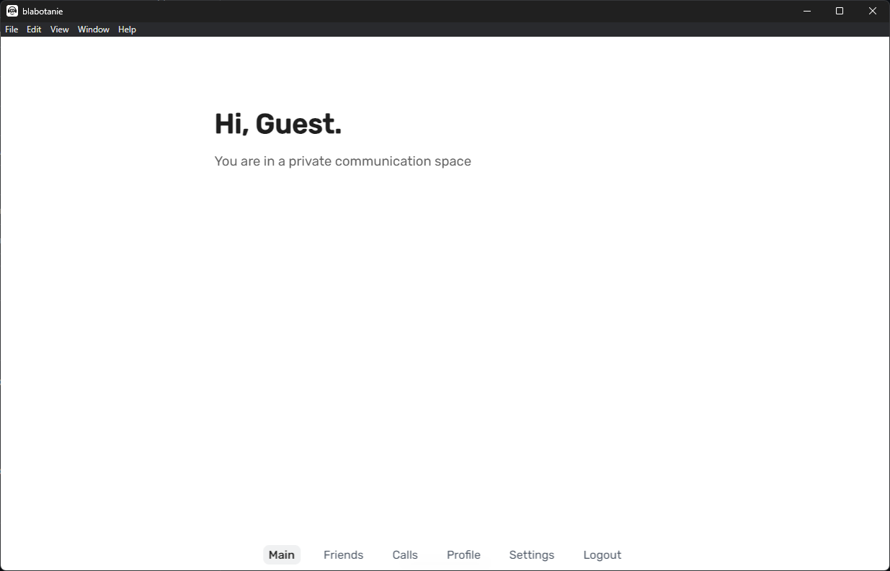
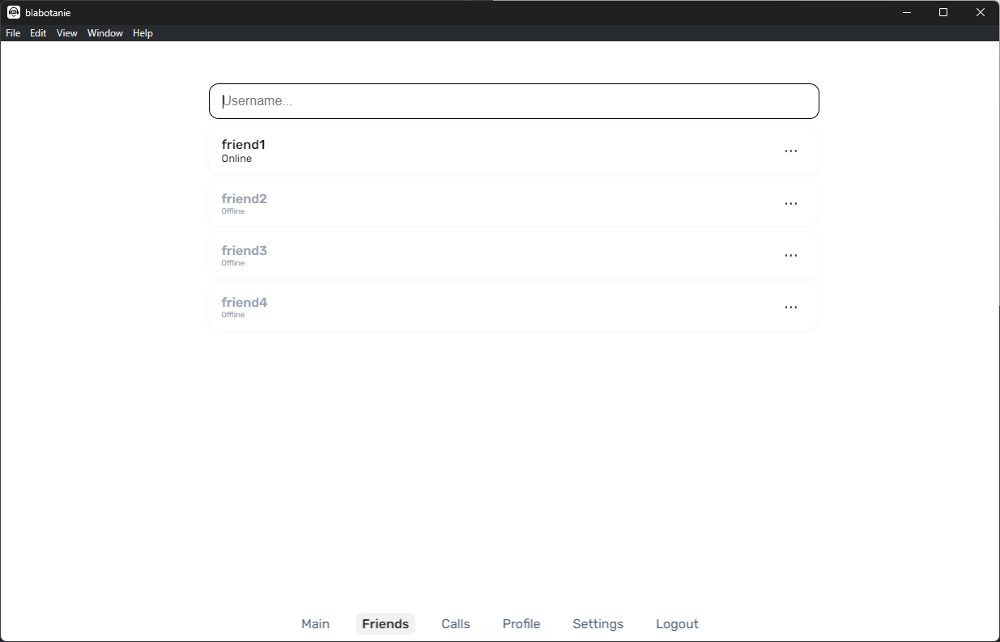
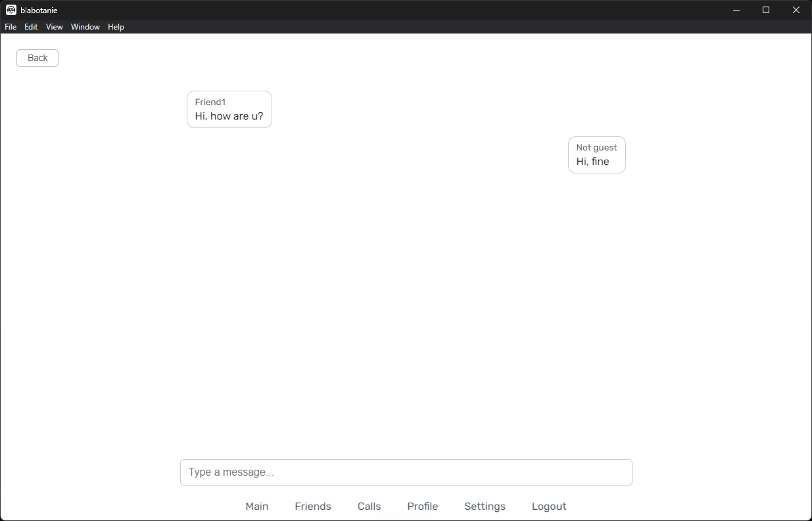

## [Прочитать на русском](README.ru.md)

# Blabotanie — voice messenger

**Blabotanie** is a desktop application for communicating with friends that supports:

1. Voice Calls (WebRTC),
2. Messaging (WebSocket + STOMP),
3. Friends list and real-time requests,
4. Auto-update, auto-start, work in the tray, encryption of chats and notifications.

## Technology stack

| Client           | Server             | Data exchange     |
|------------------|--------------------|-------------------|
| Electron (React) | Spring Boot (Java) | WebSocket (STOMP) |
| WebRTC           | PostgreSQL         | REST API + JWT    |

----------------

## Features

1. Adding and managing friends
2. Real-time calls (WebRTC, ICE)
3. Encrypted Chat
4. Online status display
5. Auto-update via GitHub Releases
6. Auto-start and collapse to the tray

-----

## Screenshots





----------

## Installation

### Ready Release (Windows):

1. Go to Releases
2. Download the .exe file of the latest version
3. Install and launch

### For developers:

```bash
git clone https://github.com/Miffle/blabotanie.git
```

```bash
cd blabotanie
```

```bash
npm install
```

Launching the app

```bash
npm start
```

Assembling the installer

```bash
npm run dist
```

The distribution and auto-update are being prepared using electron-builder.

## Implementation features

1. STOMP/WebSocket client with authorization
2. WebRTC ICE candidates are transmitted via WebSocket
3. XSS protection in chat (escapeHTML)
4. Updates are downloaded and installed without unnecessary user involvement

## Security
1. All messages are screened before being displayed
2. ICE and STUN are used for NAT traversal, voice only (no video)