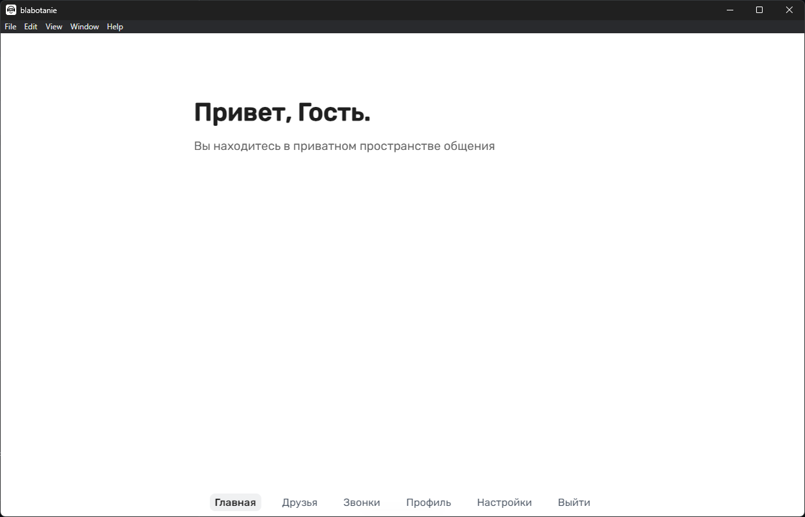
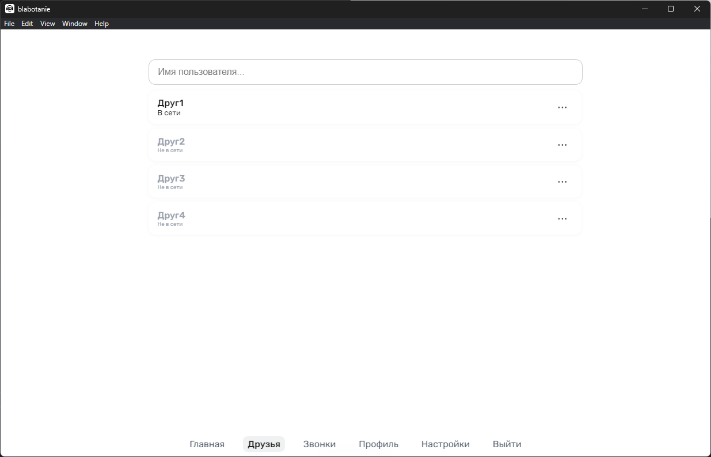
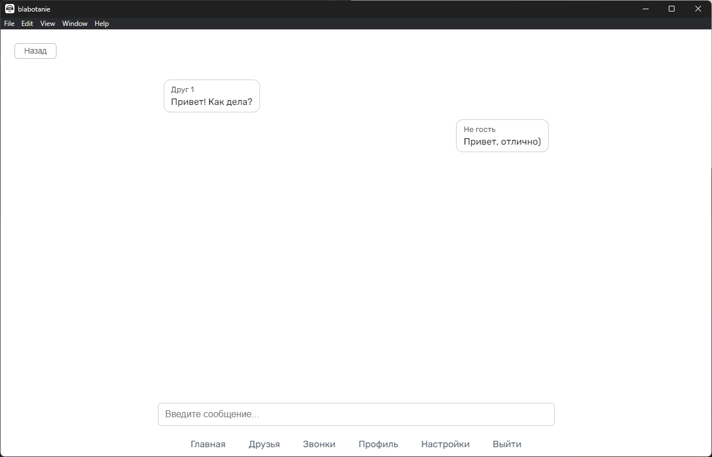

## [Read in English](README.md)
# Blabotanie — голосовой мессенджер
**Blabotanie** — это десктопное приложение для общения с друзьями, поддерживающее:
1. голосовые звонки (WebRTC),
2. обмен сообщениями (WebSocket + STOMP),
3. список друзей и заявки в реальном времени,
4. автообновление, автозапуск, работу в трее, шифрование чатов и уведомления.

## Стек технологий

| Клиент           | Сервер             | Обмен данными     |
|------------------|--------------------|-------------------|
| Electron (React) | Spring Boot (Java) | WebSocket (STOMP) |
| WebRTC           | PostgreSQL         | REST API + JWT    |
----------------
## Возможности
1. Добавление и управление друзьями 
2. Вызовы в реальном времени (WebRTC, ICE)
3. Шифрованный чат
4. Отображение онлайн-статуса
5. Автообновление через GitHub Releases
6. Автозапуск и сворачивание в трей
-----
## Скриншоты




----------
## Установка
### Готовый релиз (Windows):
1. Перейди в Releases
2. Скачай .exe файл последней версии 
3. Установи и запусти

### Для разработчиков:
```bash
git clone https://github.com/Miffle/blabotanie.git
```
```bash
cd blabotanie
```
```bash
npm install
```
Запуск приложения
```bash
npm start
```
Сборка установщика
```bash
npm run dist
```
Дистрибутив и auto-update готовятся с помощью electron-builder.

## Особенности реализации
1. STOMP/WebSocket клиент с авторизацией 
2. WebRTC ICE-кандидаты передаются через WebSocket
3. Защита от XSS в чате (escapeHtml)
4. Обновления скачиваются и устанавливаются без лишнего участия пользователя

## Безопасность
1. Все сообщения экранируются перед отображением
2. ICE и STUN используются для NAT traversal, только голос (без видео)